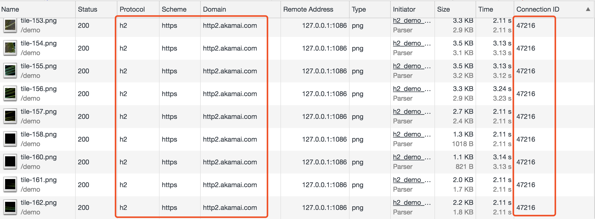

## 一. HTTP发展历史
HTTP是建立在TCP之上的应用层协议，是现代web的基础。

##### 1. HTTP 0.9  
只有一行的协议 : GET方法+要请求的文档的路径,响应是一个超文本文档，没有首部和其他元数据，只有HTML。官方文档：[the HTTP Protocol As Implemented In W3](https://www.w3.org/Protocols/HTTP/AsImplemented.html)  
特征如下：  
* 客户端 / 服务器、请求 / 响应协议  
* ASCII 协议，运行于 TCP/IP 链接之上  
* 设计用来传输超文本文档(HTML)
* 服务器与客户端之间的连接在每次请求之后都会关闭

##### 2. HTTP/1.0   
1990年代初期，诞生了第一款浏览器，随着web应用爆发，暴露了 http 0.9 的不足。1996年诞生[HTTP 1.0版本](https://www.w3.org/Protocols/HTTP/AsImplemented.html)。  
关键变化：  
* 响应内容类型不局限于超文本HTML  
* 增加了除GET之外的命令   
* 请求、响应由多行首部字段构成，描述元数据  

##### 3. HTTP/1.1   
HTTP/1.1 进一步完善了 HTTP 协议，一直用到今天还是最流行的版本。
HTTP 1.1 加入了很多重要的性能优化:
* 持久连接  
* [分块编码传输](https://foofish.net/http-transfer-encoding.html)  
* 增强的缓存机制  
* 请求管道  

##### 4. HTTP/2  
2009年，谷歌公开了自行研发的 SPDY 协议，主要解决 HTTP/1.1 效率不高的问题。2015年，HTTP/2 发布。HTTP2.0可以说是SPDY的升级版

## 二. HTTP2产生背景

新事物诞生多源于旧事物的痛点，HTTP/2也一样。

SPDY 最初由 Google 开发，2009 年年中发布，主要目标是通过解决 HTTP/1.1 中广为人知的一些性能限制来减少网页的加载延迟。2012 年，该协议得到了 Chrome、Firefox 和 Opera 的支持，越来越多的网站（如 Google、Twitter、Facebook）开始使用SPDY。HTTP 工作组 (HTTP-WG) 随之将此提上议事日程，在SPDY 基础上制定了官方“HTTP/2”标准。2015 年初，IESG 审阅了新的 HTTP/2 标准并批准发布。

## 三. HTTP1.X

#### (一)短链接&持久链接

1). HTTP/1.0 默认使用的是短连接，*每个TCP连接只能发送一个请求*。TCP连接的新建成本很高，需要客户端和服务器[三次握手](https://github.com/jawil/blog/issues/14)，同时还存在[慢启动问题](https://hpbn.co/building-blocks-of-tcp/#slow-start)。  
一个 TCP 连接发送的 HTTP 请求所花的总时间，最少等于两次网络往返的时间:一次用于握手，一次用于请求和响应。另外还有服务器处理请求的时间。  
1.0中使用持久连接需要设置Connection: keep-alive，直到客户端或服务器主动关闭。

2) HTTP/1.1 默认使用持久连接，一定程度上弥补了 HTTP1.0 每次请求都要创建连接的缺点。不过，由于 HTTP 协议采用请求-响应的模型，在一个 TCP 连接上，同一个时刻只能有一个请求，请求发送后，客户端必须等待返回。

#### (二)请求管道

1）HTTP/1.1支持请求管道（Pipelining）。  可以同时发送多个请求，但HTTP/1.x有严格的串行返回响应机制，即前一个响应没有完成，下一个响应就不能返回，如果第一个响应时间很长，后续响应处理完了也无法发送，只能被缓存起来，占用服务器内存。即[线头阻塞问题（Head-of-line blocking）](https://community.akamai.com/customers/s/article/How-does-HTTP-2-solve-the-Head-of-Line-blocking-HOL-issue?language=en_US)

请求管道的问题：
> 并行处理请求时，服务器必须缓冲管道中的响应，从而占用服务器资源，如果有个响应非常大，则很容易形成服务器的受攻击面;  
响应失败可能终止 TCP 连接，从页强迫客户端重新发送对所有后续资源的请求，导致重复处理;  
由于可能存在中间代理，因此检测管道兼容性，确保可靠性很重要;  
如果中间代理不支持管道，那它可能会中断连接，也可能会把所有请求串联起来。

由于存在这些以及其他类似的问题，而 HTTP 1.1 标准中也未对此做出说明，HTTP 管道技术的应用非常有限。一些支持管道的浏览器，通常都将其作为一个高级配置选项，但大多数浏览器都会禁用它。

#### (三)并发TCP连接

由于HTTP1.X不支持多路复用，实际情况是浏览器允许并行打开多个TCP会话。
但是浏览器对于同一个域名会由最大连接限制（这个根据浏览器内核不同可能会有所差异一般6个8个等），超过浏览器最大连接数限制，后续请求就会被阻塞。

由于并行连接的限制，产生[域名划分](http://web.jobbole.com/85579/):手工将所有资源分散到多个子域名,由于主机名称不一样了，就可以突破浏览器的连接限制，实现更高的并行能力。域名分区使用得越多，并行能力就越强!

域名划分面对的问题：  
* 每个新主机名都要求有一次额外的 DNS 查询
* 每多一个套接字都会多消耗两端的一些资源
* 必须手工分离这些资源，并分别把它们托管到多个主机上。

如何计算最优的分区数目，很难回答。因为没有简单的方程式。取决于页面中资源的数量(每个页面都可能不一样)，以及客户端连接的可用带宽和延迟 (因客户端而异)。需要在调查的基础上做出预测，然后使用固定数量的分区。

这些限制并不是致命的，但是随着网络应用的范围、复杂性以及在我们日常生活中的重要性不断增大，它们对网络开发者和用户都造成了巨大负担，而这正是 HTTP/2 要致力于解决的：
http2标准于2015年2月获得批准，大多数高版本的浏览器已经支持它。[查看支持情况](https://caniuse.com/#search=http2)

## 四. HTTP2优势

[demo对比](https://http2.akamai.com/demo)  
效果图

观察实际效果，可以发现H2的优势非常明显。

## 五. HTTP2新特性
#### (一)多路复用 

###### 1.什么是多路复用

在 HTTP 1.x 中，使用多个 TCP 连接实现多个请求并行。但服务器的串行响应导致队首阻塞，从而造成底层TCP连接的效率低下。HTTP 2.0 实现了多向请求和响应: 同域名下所有请求都在单个TCP连接上完成，单个连接可以承载任意数量的双向数据流。同时解决了建立多个TCP连接的消耗，也解决了线头阻塞问题。

- 同一域名只有一个TCP连接

HTTP1.1的请求（并发TCP连接）

HTTP 2的请求（单一TCP连接）

- http/2多路复用与HTTP1.1持久连接

*HTTP/1.1，请求响应只能依次发送，而不能同时。*
*HTTP/2，请求响应可以不按顺序发送*

###### 2.多路复用是如何实现的
HTTP/2 所有性能增强的核心在于新的二进制分帧层。
首先了解几个相关概念
>数据流：已建立的连接内的双向字节流，可以承载一条或多条消息。  
消息：与逻辑请求或响应消息对应的完整的一系列帧。  
帧：HTTP/2 通信的最小单位，每个帧都包含帧头，至少也会标识出当前帧所属的数据流。

这些概念的关系总结如下：

>所有通信都在一个 TCP 连接上完成，此连接可以承载任意数量的双向数据流。  
每个数据流都有一个唯一的标识符和可选的优先级信息，用于承载双向消息。  
每条消息都是一条逻辑 HTTP 消息（例如请求或响应），包含一个或多个帧。  
帧是最小的通信单位，承载着特定类型的数据，例如 HTTP 标头、消息负载，等等。 来自不同数据流的帧可以交错发送，然后再根据每个帧头的数据流标识符重新组装。

客户端正在向服务器传输一个 DATA 帧（数据流 5），与此同时，服务器正向客户端交错发送数据流 1 和数据流 3 的一系列帧。因此，一个连接上同时有三个并行数据流。

###### (二)头信息压缩
每个 HTTP 传输都承载一组标头，这些标头说明了传输的资源及其属性。 在 HTTP/1.x 中，此元数据始终以纯文本形式，通常会给每个传输增加 500–800 字节的开销。如果使用 HTTP Cookie，增加的开销有时会达到上千字节。为了减少此开销和提升性能，HTTP/2 使用 HPACK 压缩格式压缩请求和响应标头元数据，这种格式采用两种简单但是强大的技术：

- 这种格式支持通过静态 Huffman 代码对传输的标头字段进行编码，从而减小了各个传输的大小。
- 这种格式要求客户端和服务器同时维护和更新一个包含之前见过的标头字段的索引列表（换句话说，它可以建立一个共享的压缩上下文），此列表随后会用作参考，对之前传输的值进行有效编码。
利用 Huffman 编码，可以在传输时对各个值进行压缩，而利用之前传输值的索引列表，我们可以通过传输索引值的方式对重复值进行编码，索引值可用于有效查询和重构完整的标头键值对。

###### (三)服务器推送
###### 1. 什么是服务器推送
HTTP/2 新增的另一个强大的新功能是，服务器可以对一个客户端请求发送多个响应。 换句话说，除了对最初请求的响应外，服务器还可以向客户端推送额外资源，而无需客户端明确地请求。

###### 2.服务器推送解决了什么问题：  
在HTTP1.1资源内嵌这种优化方式：将 CSS 内嵌在 HTML，使用 data URI 将二进制数据嵌入到 CSS ／ HTML 中等，以减少浏览器拉取外部资源的等待时间。但资源内嵌，就不能做独立缓存。HTML每次更新，则内嵌资源也要每次更新。

对于将资源手动内联到文档中的过程，我们实际上是在将资源推送给客户端，而不是等待客户端请求。使用 HTTP/2，我们不仅可以实现相同结果，还会获得其他性能优势。 推送资源可以进行以下处理：
- 由客户端缓存
- 在不同页面之间重用
- 与其他资源一起复用
- 由服务器设定优先级
- 被客户端拒绝

###### 3.推送实现
Web 服务器怎样知道客户端需要什么，如果推送了不必要的资源——比如某个资源已经被浏览器缓存——不仅不能提升加载速度还会造成网络带宽的浪费。
- [W3C](https://www.w3.org/TR/preload/)建议了依赖资源的两种做法

所有服务器推送数据流都由 PUSH_PROMISE 帧发起，表明了服务器向客户端推送所述资源的意图，并且需要先于请求推送资源的响应数据传输。  
在客户端接收到 PUSH_PROMISE 帧后，它可以根据自身情况选择拒绝数据流（通过 RST_STREAM 帧）。  
。客户端可以限制并行推送的数据流数量；可以通过设置SETTINGS_ENABLE_PUSH为0值通知服务器端禁用推送。

#### 六. 开发者启示

###### 1.每个来源使用一个连接  
HTTP 2.0 通过将一个 TCP 连接的吞吐量最大化来提升性能。事实上，在 HTTP 2.0 之下再使用多个连接(比如域名分区)反倒成了一种反模式，因为多个连接 会抵消新协议中首部压缩和请求优先级的效用。
###### 2. 去掉不必要的文件合并和图片拼接  
打包资源的缺点很多，比如缓存失效、占用内存、延缓执行，以及增加应用复杂性。有了 HTTP 2.0，很多小资源都可以并行发送，导致打包资源的效率反而更低。
###### 3. 利用服务器推送  
之前针对 HTTP 1.x 而嵌入的大多数资源，都可以而且应该通过服务器推送来交付。这样一来，客户端就可以分别缓存每个资源，并在页面间实现重用，而不必把它们放到每个页面里了。

杜绝和忘记域名分区、文件拼接、图片精灵等不良的习惯，这些做法在 HTTP 2.0 之上完全没有必要。

#### 七. 附录
chrome浏览器插件HTTP/2 and SPDY indicator，蓝色的小图标亮起，就表示该网站使用了 HTTP/2 协议。  
启用H2网站：https://www.google.com、https://www.aliyun.com
