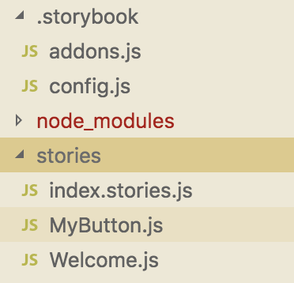
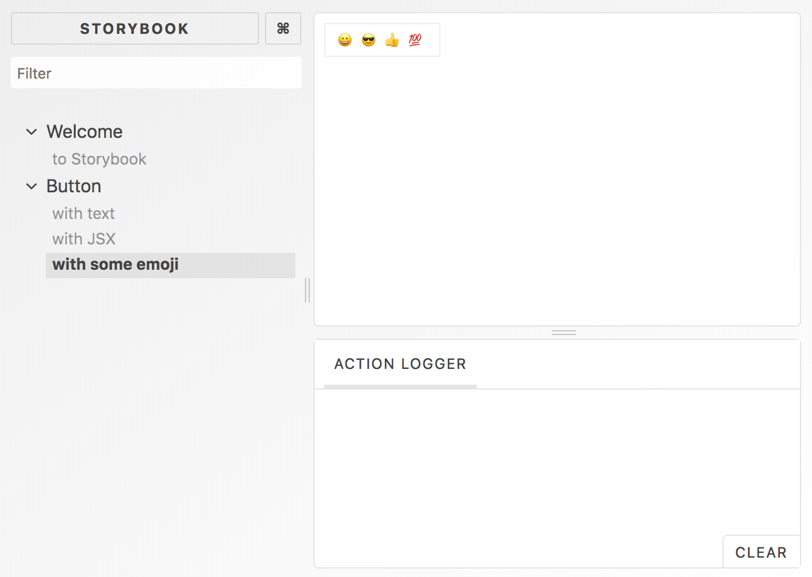
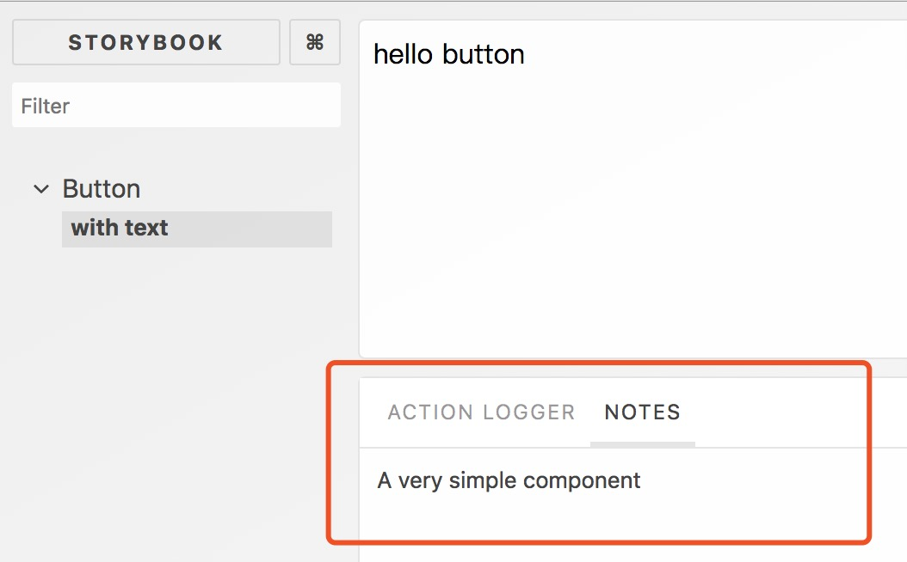
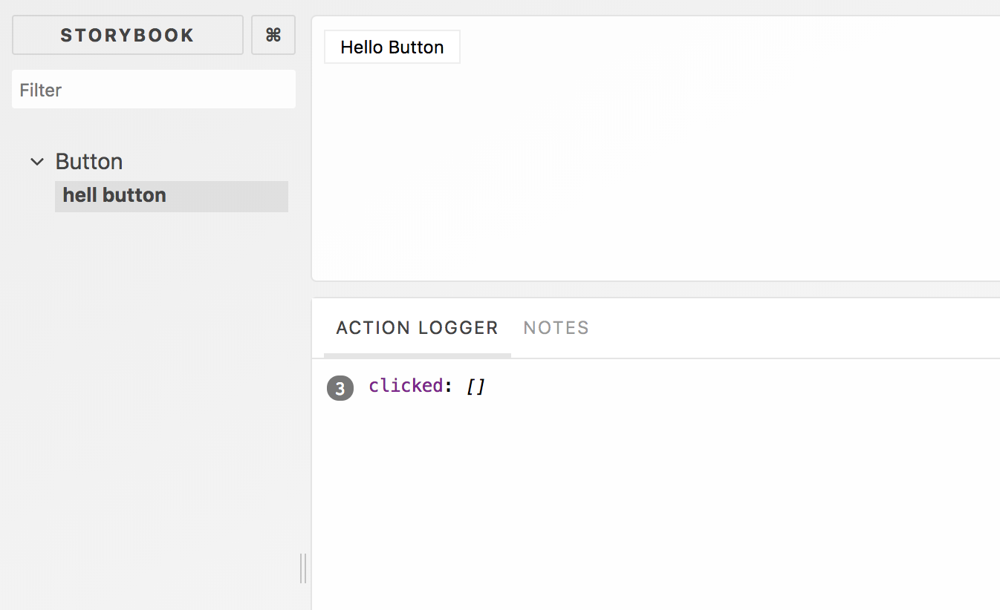
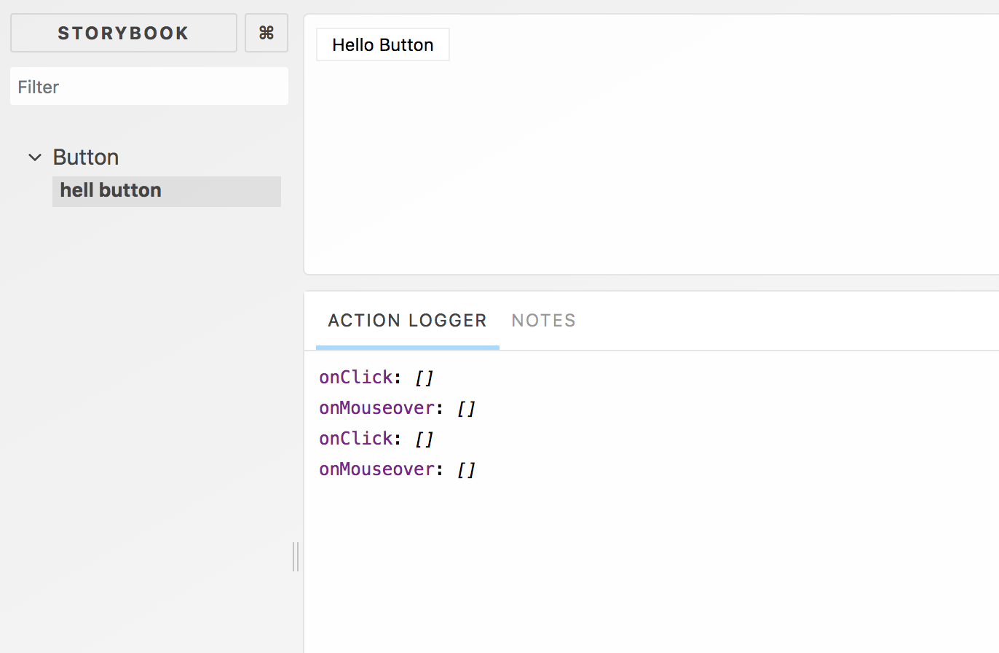
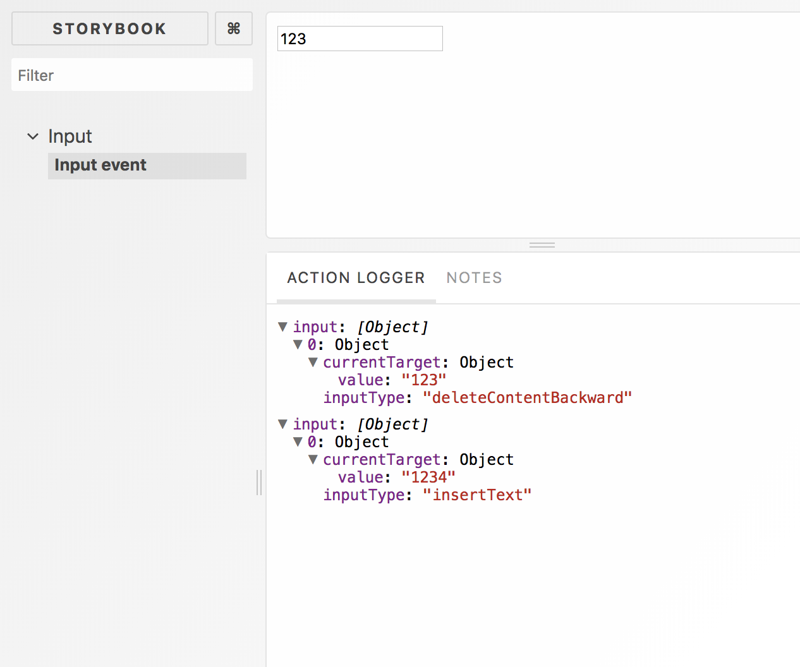
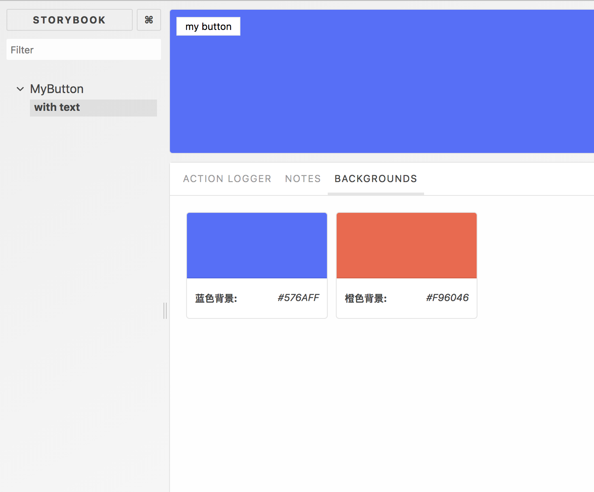
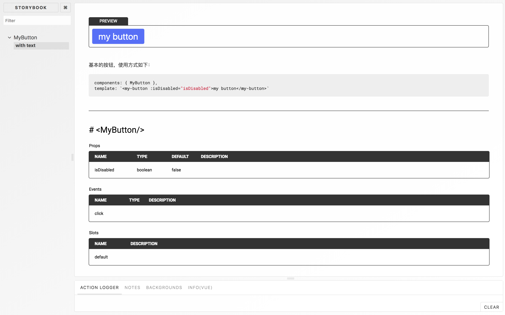

# storybook教程

storybook是一套UI组件的开发环境，可以浏览组件库，查看每个组件的不同状态，交互式开发测试组件，目前支持react、vue、angular等前端框架。

## 1. 快速上手
以vue为例，介绍storybook
- 安装  
```npm i  -g @storybook/cli```
- 初始化  
切到项目目录，执行```sb init```  
初始化成功，根目录下生成2个目录：  **\.storybook**、**stories**  
  
package.json会自动添加如下命令：  
```"storybook": "start-storybook -p 6006"```  
```"build-storybook": "build-storybook"``` 
- 安装模块  
vue、@storybook/vue、@babel/core、babel-preset-vue、vue-loader、vue-template-compiler
- 运行  
```npm run storybook```


## 2. 配置文件
- config.js
```javascript
import { configure } from '@storybook/vue';

// automatically import all files ending in *.stories.js
const req = require.context('../stories', true, /.stories.js$/);

function loadStories() {
  req.keys().forEach(filename => req(filename));
}

configure(loadStories, module);
``` 
该文件功能自动导入stories文件。
**require.context** 是 webpack 的方法，实现自动加载模块。**configure** 是 storybook 的提供的API。
## 3. 编写story文件
一个story对应一个组件的某个状态。通过编写story展示UI组库，每个story类似一个视觉测试案例。
简单示例：
```javascript
import { storiesOf } from '@storybook/vue';
import { action } from '@storybook/addon-actions';
// 导入组件
import MyButton from './MyButton';

storiesOf('Button1', module)
  .add('with text', () => ({
    components: { MyButton },
    template: '<my-button @click="action">Hello Button</my-button>',
    methods: { action: action('clicked') },
  }))
  .add('with some emoji', () => ({
    components: { MyButton },
    template: '<my-button @click="action">😀 😎 👍 💯</my-button>',
    methods: { action: action('clicked') },
  }));
  ``` 
## 4. 插件介绍
storybook 很多功能是靠插件来实现的，大多数插件都需要提前注册，.storybook下addons.js中进行注册(固定文件名)，如下注册了addon-actions和addon-links两个插件：
```javascript
import '@storybook/addon-actions/register';
import '@storybook/addon-links/register';
```
storybook 的插件分为两类：装饰器 Decorator 和 原生插件 Native Addon。
### 4.1 装饰器 Decorator
装饰器是包装组件或者一个story的装饰。  
- 包装组件
新建一个center.js  
```javascript
const styles = {
  textAlign: 'center',
};
const Center = ({ children }) => (
  <div style={styles}>
    { children }
  </div>
);
```
修改button.stories.js
```javascript
import Vue from 'vue'
import { storiesOf } from '@storybook/vue';

import MyButton from './MyButton';
import Center from './center'
Vue.component({center: Center})
Vue.component({MyButton: MyButton})

storiesOf('Button', module)
  .add('with text', () => ({
    template: '<Center><Button>Hello Button</Button></Center>'
  }))
```
实现了组件在页面居中展示  
### 4.2 原生插件 Native Addons    
原生插件提供了装饰story之外的很多功能，利用storybook平台与之交互。  
以addon-notes为例  
- 安装插件  
```npm i -save @storybook/addon-notes```  
- 在.storybook/addons.js中注册插件  
```import '@storybook/addon-notes/register'```  
- 全局配置  
插件可以在具体story中引用，也可全局配置，如下方式修改config.js即可。  
```javascript
import { configure, addDecorator } from '@storybook/vue';
import { withNotes } from '@storybook/addon-notes'
// automatically import all files ending in *.stories.js
const req = require.context('../stories', true, /.stories.js$/);
function loadStories() {
  req.keys().forEach(filename => req(filename));
}
addDecorator(withNotes)
configure(loadStories, module);
```
- 修改story  
```javascript
storiesOf('Button', module)
  .add('with text', () => ({
    components: { MyButton },
    template: '<my-button>hello button</my-button>'
  }),{
    notes: 'A very simple component'
  })
```
效果：  
  
  
### 4.3 插件列表
由storybook team 维护的支持vue的插件列表[github地址](https://github.com/storybooks/storybook/blob/master/ADDONS_SUPPORT.md)

此外还有一些有社区提供的插件见[这里](https://storybook.js.org/addons/addon-gallery/)

### 4.3 插件示例
下面是部分插件的一些使用示例
#### 4.3.1 [actions](https://github.com/storybooks/storybook/tree/master/addons/actions)  

> Storybook Addon Actions can be used to display data received by event handlers in Storybook

该插件主要用于展示event数据

- 安装  
```npm i -dev-save @storybook/addon-actions```
- 注册 addons.js   
```import '@storybook/addon-actions/register';```
- 调用 action()      
```javascript
import { action } from '@storybook/addon-actions'
import MyButton from './MyButton';
storiesOf('Button', module)
  .add('hell button', () => ({
    components: { MyButton },
    template: '<my-button @click="click">Hello Button</my-button>',
    methods: { click: action('clicked') },
    }))
```
  

- 如果需要监听多个事件，还可以使用actions()    
```javascript
import { storiesOf } from '@storybook/vue';
import { actions } from '@storybook/addon-actions'
import MyButton from './MyButton';
storiesOf('Button', module)
  .add('hell button', () => ({
    components: { MyButton },
    template: '<my-button @click="onClick" @mouseover="onMouseover">Hello Button</my-button>',
    methods: { 
      ...actions('onClick', 'onMouseover')
    }
  }))
```
 
- Action Decorators   
action 装饰器可以控制log的打印数据。如下，args是一个复杂对象，经过处理只打印了inputType 与 value。
其中 decorate 的入参是函数数组，函数入参是数组参数，出参是数组。decorate的出参是一个对象，包含三个属性action、actions、withActions。action 和 actions 同上。
```javascript
import { storiesOf } from '@storybook/vue';
import { decorate } from '@storybook/addon-actions'
const firstArg = decorate([
  args => {
    return args.map(({ inputType, currentTarget: { value } }) => ({ inputType, currentTarget: { value } }))
  }
]);
storiesOf('Input', module)
  .add('Input event', () => ({
    template: '<input value="123" @input="input"></input>',
    methods: { input: firstArg.action('input') }
  }))
```
 

#### 4.3.2 [backgrounds](https://github.com/storybooks/storybook/tree/master/addons/backgrounds)  

该插件用于改变展示页面的背景色。若组件要应用于某个背景色中，可修改背景色预览效果。

- 安装  
```npm i -D-save @storybook/addon-backgrounds```
- 注册  
```import '@storybook/addon-backgrounds/register'```  
- 使用    

1. 局部使用  
修改对应story, 只有button组件生效
```javascript
import { storiesOf } from '@storybook/vue';
import { withBackgrounds } from '@storybook/addon-backgrounds';
import MyButton from './MyButton.vue';
storiesOf('MyButton', module)
  .addDecorator(
    withBackgrounds([
      { name: '蓝色背景', value: '#576AFF', default: true },
      { name: '橙色背景', value: '#F96046' },
    ])
  )
  .add('with text', () => {
    return {
      components: { MyButton },
      props: {
        isDisabled: true
      },
      template: `<my-button>my button</my-button>`
    }
  })
```
 

2. 全局配置  
config.js中增加如下代码，所有story都会有两个背景色可选，默认蓝色  
```javascript
import { configure, addDecorator } from '@storybook/vue';
import { withBackgrounds } from '@storybook/addon-backgrounds';

addDecorator(
  withBackgrounds([
    { name: '蓝色背景', value: '#576AFF', default: true },
    { name: '橙色背景', value: '#F96046' },
  ])
)
```
全局配置下，想修改某个 story 的背景色，调用addParameters 重写背景色
```javascript
storiesOf('MyButton', module)
  .addParameters({
    backgrounds: [
      { name: 'red', value: '#F44336' },
      { name: 'blue', value: '#2196F3', default: true },
    ],
  })
```
全局配置下，某个 story 不想启用背景色，设置 addParameters 的 backgrounds 为空
```javascript
storiesOf('MyButton', module)
  .addParameters({
    backgrounds: [],
  })
```
或者使用 disable  
```javascript
storiesOf('MyButton', module)
  .add('with text', () => {
    return {
      components: { MyButton },
      template: `<my-button>my button</my-button>`
    }
  },{
    backgrounds: { disable: true }
  })
```

#### 4.3.3 [storybook-addon-vue-info](https://github.com/pocka/storybook-addon-vue-info)  

官方维护了一个 [info](https://github.com/storybooks/storybook/tree/master/addons/info) 插件，但是目前不支持 vue。[storybook-addon-vue-info](https://github.com/pocka/storybook-addon-vue-info) 提供与 info 类似的功能，支持 vue 框架。

该插件主要用于展示更多组件相关的信息，默认storybook只是展示UI组件的预览效果。

- 安装  
```npm install --save-dev storybook-addon-vue-info@beta```
- 注册  
```import 'storybook-addon-vue-info/lib/register'```
- webpack配置  
在.storybook/webpack.config.js中增加如下内容
```javascript
module.exports = (base, env, defaultConfig) => {
  defaultConfig.module.rules.push({
    test: /\.vue$/,
    loader: 'storybook-addon-vue-info/loader',
    enforce: 'post'
  })
  return defaultConfig
}
```  
- 使用  
在config中全局配置(当然也可以在具体story中使用)
```javascript
import { setDefaults } from 'storybook-addon-vue-info'
setDefaults({
  header: false, // 是否显示头部
  source: false, // 是否显示源码
  docsInPanel: false // 显示位置：面板 或 预览区域
})
```
在story中使用, info中的 summary 可接受 markdown 格式的字符串。
```javascript
import { storiesOf } from '@storybook/vue';
import { withInfo } from 'storybook-addon-vue-info'
import MyButton from './MyButton.vue';
storiesOf('MyButton', module)
  .addDecorator(withInfo)
  .add('with text', () => ({
    components: { MyButton},
    template: `<my-button>my button</my-button>`
  }),{
    info: {
      summary: `基本的按钮，使用方式如下：
      \`\`\`
      components: { MyButton },
      template: \`<my-button :isDisabled="isDisabled">my button</my-button>\`
      \`\`\`     
      `
    }
  })
```
 

#### 4.3.4 [knobs](https://github.com/storybooks/storybook/tree/master/addons/knobs)  

该插件可以动态修改props的属性。  
- 安装    
```npm install @storybook/addon-knobs --save-dev```
- 注册    
```import '@storybook/addon-knobs/register'```
- 使用  
```javascript
import {
  withKnobs,
  text,
  boolean,
  number
 } from '@storybook/addon-knobs';
import MyButton from './MyButton';
storiesOf('Button', module)
  .addDecorator(withKnobs)
  .add('with text', () => {
    return {
      components: { MyButton },
      props: {
        isDisabled: {
          //  get a boolean value from the user
          default: boolean('Disabled', true)
        },
        text: {
          // get some text from the user
          default: text('button-text', 'Hello Storybook')
        },
        count: {
          default: number('count', 0)
        }
      },
      template: `<my-button :isDisabled="isDisabled">{{ text }} {{ count }}</my-button>`
    }
  })
```
 

## 5. storybook的发展过程
storybook 最早称为React storybook，只支持react，从3.0版本更名为story。

3.2版本开始支持Vue。
最开始是个人项目，2017年4月交由社区开发维护。
2017年6月开源，版本是3.0.0
2017年7月，发布3.2版本，支持VUE。
